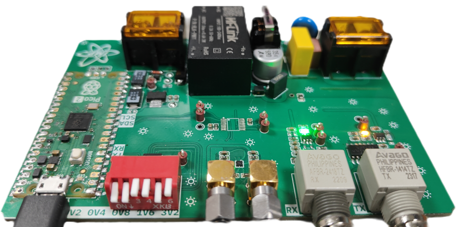

# UART on FIBER to I2C on COAX CABLE

## prototype version 1

  
 click me to show images of prototype version 1

  
  
  

## bugs [tbd]

## usage
- connect UART TX/RX fiber cable
- connect I2C SDA/SCL coax cable
- set I2C target board VOLTAGE by 6-way switch
- power up both boards
